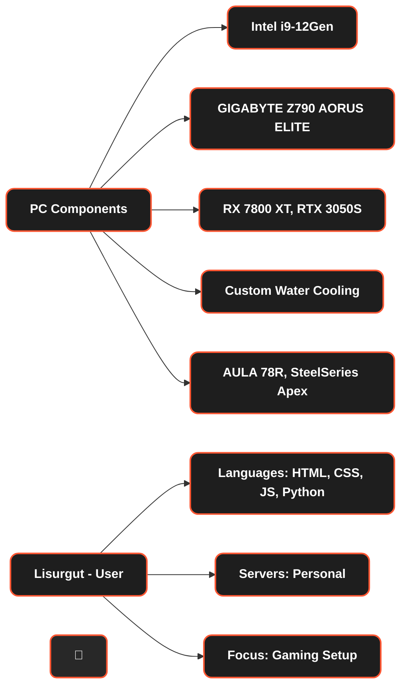

```mermaid
flowchart LR;
    %% Main node style
    classDef main fill:#1e1e1e,stroke:#ff5733,stroke-width:2px,color:#ffffff,font-weight:bold,rx:10,ry:10;
    classDef normal fill:#282828,stroke:#ff5733,stroke-width:2px,color:#ffffff,rx:8,ry:8;

    %% Define the blocks for PC Hardware
    PCHardware["PC Components"]:::main;
    PCHardware --> P2["Intel i9-12Gen"]:::main;
    PCHardware --> P3["GIGABYTE Z790 AORUS ELITE"]:::main;
    PCHardware --> P4["RX 7800 XT, RTX 3050S"]:::main;
    PCHardware --> P5["Custom Water Cooling"]:::main;
    PCHardware --> P6["AULA 78R, SteelSeries Apex"]:::main;

    %% Define the blocks for Lisurgut Info
    LisurgutInfo["Lisurgut - User"]:::main;
    LisurgutInfo --> L2["Languages: HTML, CSS, JS, Python"]:::main;
    LisurgutInfo --> L3["Servers: Personal"]:::main;
    LisurgutInfo --> L4["Focus: Gaming Setup"]:::main;

    %% Add emoji in the upper left corner (without connecting to other blocks)
    Notebook["📝"]:::normal;

    %% Position the notebook block manually
    class Notebook position:top;
```
 
